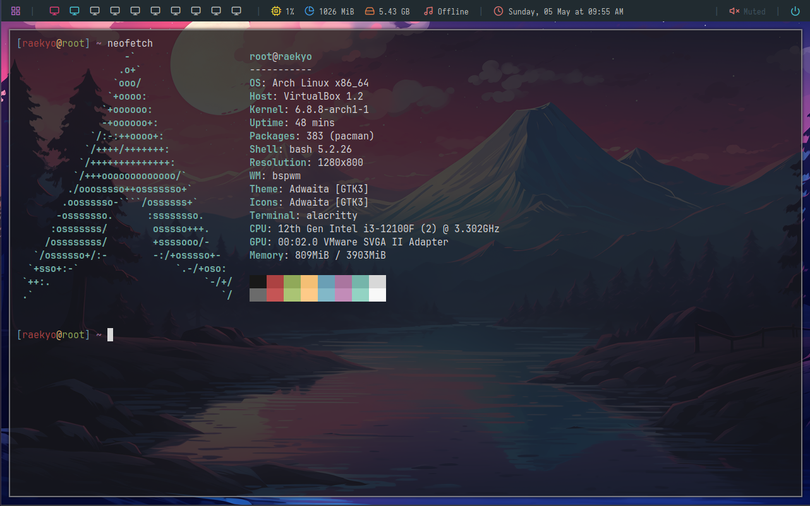

## OS
- unix: ArchLinux



## Installed package
- bspwm    : wm
- sxhkd    : simple x hotkey daemon
- xorg-server : xorg
- xorg-xinit  : xorg init file configuration

- ttf-jetbrains-mono-nerd: font

- polybar  : bar (addition font and icon in .config/polybar - adi1090x)
- dmenu    : daemon application
- feh      : wallpaper
- alacritty: terminal emulator
- picom    : transparent and animation


## Install guide
```shell
  git clone https://github.com/tien-rayujin/dotfiles.git
  pacman -S bspwm sxhkd xorg-server xorg-xinit ttf-jetbrains-mono-nerd polybar dmenu feh alacritty picom
```

#### Copy config file
```shell
  cd dotfiles
  mkdir ~/.config

  // config file
  cp ./.config ~/.config

  // bash prompt
  cp ./.bashrc ~/
  cp ./.xinitrc ~/
  cp ./xorg.conf ~/


  // wallpaper (I normally placed it in Downloads directory - If you placed somewhere else config the path in ~/.config/bspwm/bspwmrc
  cp ./wallpaper.png ~/Downloads

  // run the xorg environemnt
  startx
```
